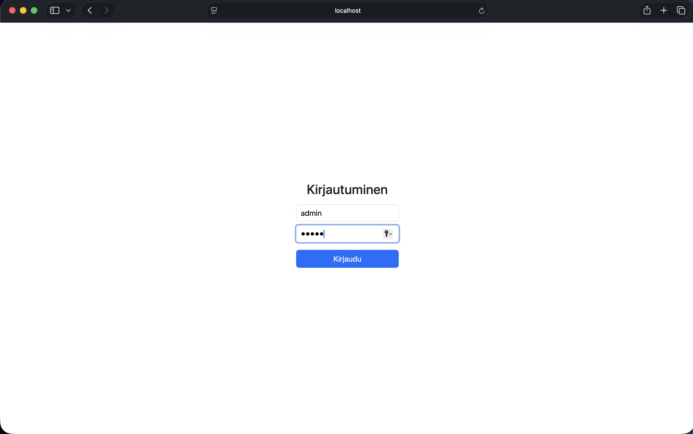
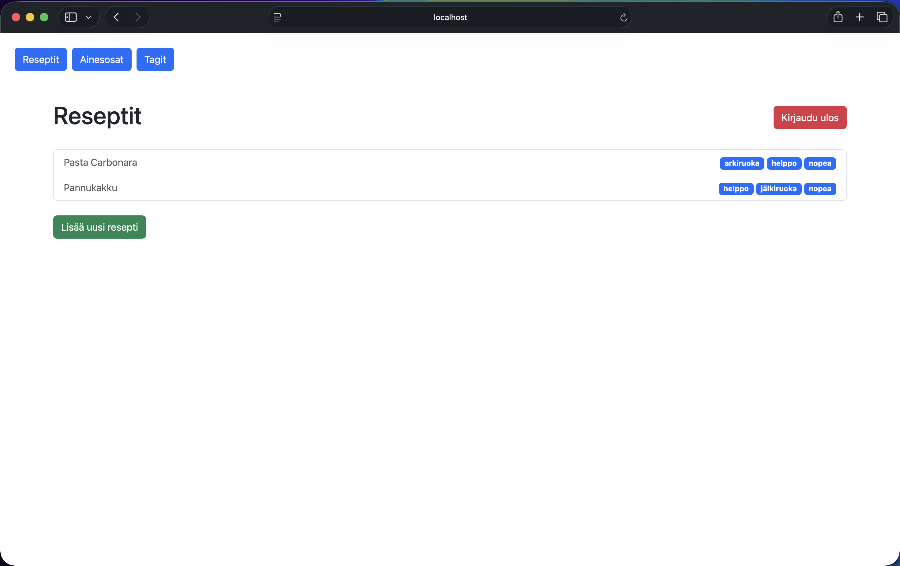
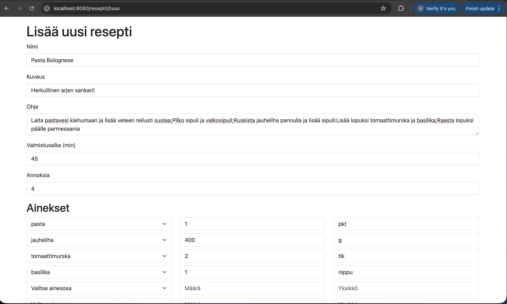

# 👨‍🍳 Resepti App

Resepti App is a full-stack CRUD web application for managing recipes, designed for home chefs and cooking enthusiasts.    
It is built with Java Spring Boot, Spring Security, Thymeleaf, Bootstrap and PostgreSQL.

## 🧠 Why I built this

I built Resepti App to deepen my knowledge of the Spring ecosystem and relational database design with PostgreSQL.

During the development, I focused on:
- Implementing authentication and role-based access control (RBAC) with Spring Security
- Designing and managing many-to-many relationships
- Applying validation constraints using Bean Validation (e.g. @NotNull, @Size, @Email)
- Building error handling for form submissions
- Structuring a maintainable MVC (Model-View-Controller) architecture with Thymeleaf views

## 📸 Preview

### Login


### Recipes


### Add Recipe


## 🔑 Demo Credentials

You can log in using the following demo accounts:

### 👨‍💼 Admin
- Username: admin
- Password: admin

### 🧑 User
- Username: user
- Password: user

## 📦 Product Overview

Resepti App supports two roles: ADMIN and USER, with role-based permissions enforced via Spring Security.

### 🛠️ ADMIN capabilities

Administrators have full CRUD access to the system:
- Create, update and delete recipes, ingredients and tags

### 🧑‍💼 USER capabilities

Regular users have read-only access:
- View all recipes
- View each recipe instructions

## ⚙️ Architecture
- Frontend: Thymeleaf, Bootstrap
- Backend: Spring Boot (MVC + REST Controllers)
- API Layer: RESTful endpoints
- Database: PostgreSQL
- ORM: Spring Data JPA / Hibernate

## ✨ Features

### 🔐 Authentication & Authorization
- Secure login system using Spring Security
- Role-Based Access Control (RBAC)
- Protected routes based on user roles

### 👨‍🍳 Recipe Management (CRUD)
- Create, read, update and delete recipes (ADMIN only)
- View details recipe pages including ingredients and instructions
- Structured recipe data with relational mapping

### 🧂 Ingredients & Tags System
- Manage ingredients and tags independently
- Associate multiple ingredients and tags with recipes
- Many-to-many relationships implemented using JPA/Hibernate

### ✅ Validation & Error Handling
- Bean Validation used for form validation
- Server-side validation for user inputs
- User-friendly error messages and feedback

### 🎨 Server-Side UI
- Thymeleaf templates for dynamic server-rendered pages
- Bootstrap for clean UI designs

### 🗄️ Database Integration
- PostgreSQL used as the relational database
- JPA/Hibernate for ORM and entity management
- Proper relational schema design with normalized structure

### 🌱 Development Features
- Seed data for testing and development purposes
- Consistent MVC architecture

## 📡 REST API Layer

In addition to Thymeleaf-based UI, the application exposes a REST API for core resources.  

The API follows standard REST principles and returns JSON responses.

All write operations (POST, PUT, DELETE) are restricted to **ADMIN** users via Spring Security.

### Recipes API

| Method | Endpoint | Description |
|------|--------|------------------------|
|GET | /api/reseptit | Get all recipes |
|GET | /api/reseptit/{id} | Get a single recipe |
|POST | /api/reseptit | Create a new recipe |
|PUT | /api/reseptit/{id} | Update an existing recipe |
|DELETE | /api/reseptit/{id} | Delete a recipe |

### Ingredients API

| Method | Endpoint | Description |
|------|--------|------------------------|
|GET | /api/ainesosat | Get all ingredients |
|GET | /api/ainesosat/{id} | Get a single ingredient |
|POST | /api/ainesosat | Add a new ingredient |
|PUT | /api/ainesosat/{id} | Update an existing ingredient |
|DELETE | /api/ainesosat/{id} | Delete an ingredient |

### Tags API

| Method | Endpoint | Description |
|------|--------|------------------------|
|GET | /api/tagit | Get all tags |
|GET | /api/tagit/{id} | Get a single tag |
|POST | /api/tagit | Create a new tag |
|PUT | /api/tagit/{id} | Update an existing tag |
|DELETE | /api/tagit/{id} | Delete a tag |


## 🚀 Running the Project Locally

### Prerequisites
- Java 17+
- Maven
- PostgreSQL

### 🛠️ Setup

1. Clone repository
```bash
git clone https://github.com/Atte-A/hh-backend-resepti.git
cd hh-backend-resepti
```

2. Configure PostgreSQL database
Update `application.properties`
```bash
spring.datasource.url=jdbc:postgresql://localhost:5432/your_db
spring.datasource.username=your_username
spring.datasource.password=your_password
```
3. Run the application
```bash
mvn spring-boot:run
```
4. Open in browser
http://localhost:8080

## 🚧 Future Improvements
- Recipe images
- Pagination and filtering for recipes
- Recipe ratings and comments system
- UI/UX enhancements

## 👤 Author  

Atte Ampuja – [GitHub](https://github.com/Atte-A) | [LinkedIn](https://www.linkedin.com/in/atteampuja)

## ⚖️ License  

This product is licensed under the [MIT License](https://opensource.org/licenses/MIT).


